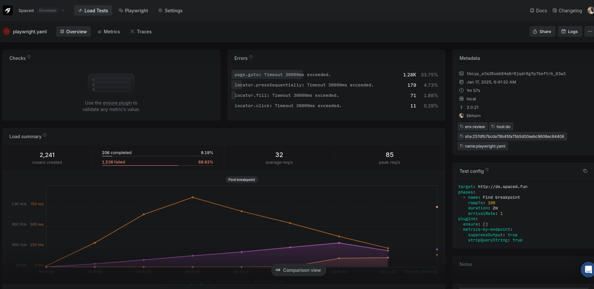
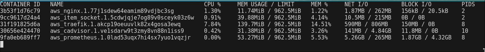
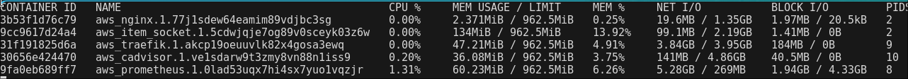

# Spaced <!-- omit in toc -->

## Blazingly Fast Knowledge Base <!-- omit in toc -->


|         |                      |
| ------- | -------------------- |
| Date    | 2024-11-17           |
| Version | 1.0                  |
| State   | final                |
| Author  | Koen Schellingerhout |
|         |                      |

<div style="page-break-after: always;"></div>

#### Version history <!-- omit in toc -->

| Version | Date       | Author               | Changes         | State |
| ------- | ---------- | -------------------- | --------------- | ----- |
| 0.1     | 2024-11-15 | Koen Schellingerhout | initial version | draft |
| 1.0     | 2024-01-15 | Koen Schellingerhout |                 | draft |
| 1.0     | 2024-01-17 | Koen Schellingerhout |                 | final |

#### Distribution <!-- omit in toc -->

| Version | Date       | Receivers            |
| ------- | ---------- | -------------------- |
| 0.1     | 2024-11-15 | Canvas: Erik Schriek |
| 1.0     | 2025-01-17 | Canvas: Erik Schriek |


<div style="page-break-after: always;"></div>

## Contents <!-- omit in toc -->

<style>
  .toc > ul { padding-left: 1em; }
  .toc > * * ul { padding-left: 1em; }
  .toc > * > li { list-style-type: none; }
  .toc > * * > li { list-style-type: none; }
</style>

<div class="toc">

- [1. Research questions](#1-research-questions)
- [2. Results](#2-results)
  - [2.1. Preliminary questions](#21-preliminary-questions)
    - [2.1.1. What actions are expected to be involved?](#211-what-actions-are-expected-to-be-involved)
    - [2.1.2. Which providers should be tested on their VPS hosting?](#212-which-providers-should-be-tested-on-their-vps-hosting)
    - [2.1.3. How to generate realistic loads for the VPS instances?](#213-how-to-generate-realistic-loads-for-the-vps-instances)
  - [2.2 Sub questions](#22-sub-questions)
    - [2.2.1. What load tests should be conducted?](#221-what-load-tests-should-be-conducted)
    - [2.2.2. How are bottlenecks holding back the maxium threshold?](#222-how-are-bottlenecks-holding-back-the-maxium-threshold)
    - [2.2.3. How can Spaced be optimized to increase the maximum threshold?](#223-how-can-spaced-be-optimized-to-increase-the-maximum-threshold)
- [3. Conclusion](#3-conclusion)

</div>

<div style="page-break-after: always;"></div>

## 1. Research questions

**Primary question**

How to make creating and collaborating on documents in Spaced for students and experts as cheap as possible while maintaining a 99% reliable latency of less than 1 second?

| Vertical scalability |                                                                                                                                                                                |
| -------------------- | ------------------------------------------------------------------------------------------------------------------------------------------------------------------------------ |
| **Preliminary**      | 1. What actions are expected to be involved? <br> 2. Which providers should be tested on their VPS hosting? <br> 3. How to generate realistic loads for the VPS instances?     |
| **Sub questions**    | 1. What load tests should be conducted? <br> 2. How are  bottlenecks holding back the maxium threshold? <br> 3. How can Spaced be optimized to increase the maximum threshold? |


<div style="page-break-after: always;"></div>

## 2. Results

### 2.1. Preliminary questions

#### 2.1.1. What actions are expected to be involved?

Spaced currently has the ability for a user to create new documents, share them, and to collaboratively edit documents. Disconnecting you document instance from others is also possible not interesting from a performance standpoint as document cleanup is not fully working.

These actions belong to 2 different scenario's, people either create a new document and start sharing it, or people would instead connect to a shared document and edit it.

#### 2.1.2. Which providers should be tested on their VPS hosting?

The tests to be conducted should ideally be free if a provider has a free-trial or free-credits those should be part of the list. Providers such as Google Cloud, Amazon Web Services and Azure have various free plans [<sup>[1]</sup>][aws][<sup>[2]</sup>][azure][<sup>[3]</sup>][google_cloud].

[aws]: https://aws.amazon.com/free
[azure]: https://learn.microsoft.com/en-us/azure/cost-management-billing/manage/avoid-charges-free-account
[google_cloud]: https://console.cloud.google.com/compute/instancesAdd

Furthermore if a provider is popular they should be considered to capture the widest audience possible. Cheap VPS providers that can provide a VPS with at least 696Mi available RAM for nixos-anywhere (to kernel swap) may also be considered[<sup>[4]</sup>][hosting]. However sadly for Azure this means it's the end of the road as [nixos-anywhere does not work on secure boot](https://github.com/nix-community/nixos-images/issues/128#issuecomment-2327279764).

[hosting]: https://console.cloud.google.com/compute/instancesAdd

A couple relatively cheap providers and somewhat popular are: [digitalocean](https://www.digitalocean.com/pricing/droplets), [hetzner](https://www.hetzner.com/cloud/), and [ionos](https://www.ionos.de/server/vps#tarife).

So the final list is as follows: AWS, ~~Google Cloud~~, DigitalOcean, ~~Hetzner, IONOS~~
> Note: the crossed out providers were not tested for the final results in this research, however future research will probably be conducted on those.

#### 2.1.3. How to generate realistic loads for the VPS instances?

The best way to simulate users interacting is to this full E2E. [Artillery + Playwright](https://www.artillery.io/docs/reference/engines/playwright#why-load-test-with-headless-browsers) allows for testing realistic loads by calling APIs directly from the frontend. Artillery also provides more cumbersome, but lightweight solutions like direct Socket.IO connections.

The Item Socket service in the backend is also just a bit unconventional as it's sending binary websocket messages for document edits which use CRDTS (Conflict-free replicated data types) combined with SocketIO adding a lot more complexity to manually writing requeries.

There's also [k6.io](https://k6.io/) which supports Playwright, but [unlike Artillery](https://www.artillery.io/docs/reference/engines/socketio) it doesn't support Socket.IO directly.

<div style="page-break-after: always;"></div>

### 2.2 Sub questions

#### 2.2.1. What load tests should be conducted?

Based on the Grafana Labs documentation the following Load Test Types are relevant[<sup>[5]<sup>][grafana]:

- **Breakpoint tests** usually ramp up VUs (virtual users) (or request rates) until the limits of the system have been reached, so they can be identified.
- **Smoke tests** validate the test scripts and deployments are in working condition, the usual time-frame is in seconds or minutes.
- **Average-load tests** is the normally expected load on the system. The time frame can range from a couple minutes to an hour.
- **Stress tests** are at an increased load, but share a similar test duration as Average-load tests.
- **Spike tests** simulate high traffic for a short period. Usually a couple minutes to get to understand how the system behaves at it's limits.
- **Soak tests** long running tests that usually take a couple hours. They check the reliability of the system under load and is similar to Average-Load test load.

[grafana]: https://grafana.com/docs/k6/latest/testing-guides/test-types/

Artillery has 2 important concepts to form load tests. The first are [scenario's](https://www.artillery.io/docs/reference/test-script#scenarios-section) which describe what the test should execute and are randomly selected. Weights can be added to make one scenario more prevelant. The second concept are [phases](https://www.artillery.io/docs/reference/test-script#phases---load-phases) which describe how the test is executed; how many virtual users should arrive each second and for how long.

Putting this together into a GitHub pipeline for reproducible tests, breakpoint tests can be first to run to figure out the upper limit and to determine how to scale the parameters for the rest of the tests. Then a smoke test to start off with making sure things work, and simply increasing the load bit by bit first to average-, and to stress level. Finally some spike tests after a little pause to check fault tolerance. Soak tests are maybe something to consider for a staging environment, but are out of scope for this research.


<!--

understanding Artillery metrics

FCP = [First Contentful Paint](https://web.dev/articles/fcp)
TTFB = [Time To First Byte](https://web.dev/articles/ttfb)
LCP = [Largest Contentful Paint](https://web.dev/articles/lcp)
FID = [First Input Delay](https://web.dev/articles/fid)


Web Vitals

LCP (Largest Contentful Paint)
CLS (Cumulative Layout Shift)
INP (Interaction to Next Paint)
TTFB (Time To First Byte)
FCP (First Contentful Paint)
FID (First Input Delay)

-->

<div style="page-break-after: always;"></div>

#### 2.2.2. How are bottlenecks holding back the maxium threshold?

The result of the first breakpoint test was not fully recorded as the `rampTo` rate of 100 was to much for the test executor to handle as it froze. _The test executor has a Ryzen 5950x (16 cores / 32 threads) and 32 GB RAM._

- [Results: Breakpoint 1 - DigitalOcean 1GB RAM / 1 vCPU](https://app.artillery.io/share/sh_c9ff8f1dd1c95e442efa7c5f42321a29f862925953c65ad05ae387ba281df07e)



The threshold limits were defined in the following way:
> ```yaml
> maxErrorRate: 1 # Percentage
> # The steps here represent the steps taken for either of the 2 previously defined scenario's (see 2.2.1.)
> browser.step.open.p99  < 1000 and| browser.step.open.p99 < 1000 and
> browser.step.create.p99< 1000 and| browser.step.join.p99 < 1000 and
> browser.step.share.p99 < 1000    | browser.step.create_check_list.p99 < 2000
> ```

After another breakpoint test the first values for the Smoke-, Average-, Stess-, and Spike tests could be determined. To do so, some manual conversions need to be made as there is no direct arrival rate number that Artillery provides in their reports. So this will be determined by taking the 472 VUs created before things reached the threshold limits and dividing that by 10, because the numbers are gathered roughly every 10 seconds the max ArrivalRate without issues then "in theory" would be about 47 VUs every second. Now that value was distributed over tests in the following manner: [See results DigitalOcean](https://app.artillery.io/share/sh_9dc384912cd3298bc6c185ccdb47f6e27fe09535ee50a878e9a077a2192c8f97)

```sh
export SMOKE_RATE=5    # 47.2 * .1 rounded
export AVG_RATE=24     # 47.2 * .5 rounded
export STRESS_RATE=34  # 47.2 * .75 rounded
export SPIKE_RATE=47   # 47.2 rounded
```

<div style="page-break-after: always;"></div>

The following results were attempts to find the recommended sweet spot for the VPS, but it's clear that there are installability issues. The most prolific errors are `Socket(Closed)` and `Socket([InternalChannelFull..])`.

- [Results: AWS `SMOKE_RATE=2,AVG_RATE=8,STRESS_RATE=11,SPIKE_RATE=15`](https://app.artillery.io/share/sh_a1e4ce4954b74e0ef11ba5d2d73bd7ec96178c67a9214b8c7e941c70a22981df)
---
- [Results: AWS `SMOKE_RATE=1,AVG_RATE=5,STRESS_RATE=8,SPIKE_RATE=11`](https://app.artillery.io/share/sh_d2b85f7e15b14871a7e4fb1b5e0be56b341e198ba6f3127d10e2bfe3fd589ed1)
- [Results: DigitalOcean `SMOKE_RATE=1,AVG_RATE=5,STRESS_RATE=8,SPIKE_RATE=11`](https://app.artillery.io/share/sh_24336f637766a458ee907c638eae51649810a11a9090885386a840d2310f38c2)
---
- [Results: AWS `SMOKE_RATE=1,AVG_RATE=5,STRESS_RATE=7,SPIKE_RATE=10`](https://app.artillery.io/share/sh_73d26b50564319fc06167d6265cd1943b4923ff8c50c0caa66eaeb0fd09ebbaa)
- [Results: DigitalOcean `SMOKE_RATE=1,AVG_RATE=5,STRESS_RATE=7,SPIKE_RATE=10`](https://app.artillery.io/share/sh_c6d1962381de251139ac73fa45d25747e8237da99e60911d061bf09fc6d32b29)

The following bottlenecks were identified:
- **VPS & Docker Swarm**: The VPS that runs the services sometimes is overloaded not, because of the container that run inside, but actually Docker Swarm locking and spiking in CPU usage. Mostly happening during deployments.
- **Proxy-Server**: Traefik is a very versatile proxy, but it may lack in performance in some aspects as it's written in go, which has a garbage collector. Futher research needs to be conducted, but is out of scope here.

- Other services in Spaced notabily cAdvisor and Prometheus sometimes spike the CPU usage for a very brief window.
- Not only the deployment had Bottlenecks, the systems running "large-scale" load tests could not keep up in terms of memory nor CPU for that matter as Playwright headless browsers simply ask for too many resources. These test results are thus potentially holding how much the system can handle in reality.
- The **stability of the Item Socket** however is not good. Errors get thrown around quite fast while CPU usage isn't really spiking, but memory is compounding likely, because of amount of documents created.


Overall these results don't seem very impressive. Whether it's largely a stability issue or also a hardware issue more research is needed.
<!-- The fact that stability is already an issue is a clear sign the tests didn't have to be much longer, however in the future if it does get more stable the tests must extend for longer to fish out memory pilling up etc. -->

<div style="page-break-after: always;"></div>

#### 2.2.3. How can Spaced be optimized to increase the maximum threshold?

The Item Socket Service which handles all real-time document updates implemented in a lower level language like Rust already show quite decent performance. The current implementation also already uses the best known CRDT (Conflict-Free Replicated Data Type) algorithm called [YATA](https://www.researchgate.net/publication/310212186_Near_Real-Time_Peer-to-Peer_Shared_Editing_on_Extensible_Data_Types) through the help of the rust [Y-rs](https://docs.rs/yrs/latest/yrs/) package. However as mentioned before documents are not cleaned up after noone uses them, so the services needlessly holds onto that memory. Resolving this shouls in theory get it down to somewhere near idle levels.

Then about updates, in quite a few places updates are not rate-limited in anyway. For instance when typing characters in the editor it always sends a new update to the server which may be reduced to an acceptable degree if a proper throttle/debounce is applied.

Additionally it's actually other services namely the reverse-proxy that use more resources than the Item Socket Service. So the best optimization may be to move to a more lightweight proxy-server.

Notably docker container log limits have not been set which could contribute to memory consumption. The most important take away tough from the tests were clearly the instability issues.

<div style="page-break-after: always;"></div>

## 3. Conclusion

To summarize,
on all fronts bottlenecks are present, the servers tested only have 1 GB of RAM and 1 vCPU. The ensuring that uptime is met will be impossible if those instability issues aren't resolved. All services within the system may be able benefit from some configuation changes, and clearly more research is needed to be able say Spaced is a "Blazingly Fast Knowledge base".
