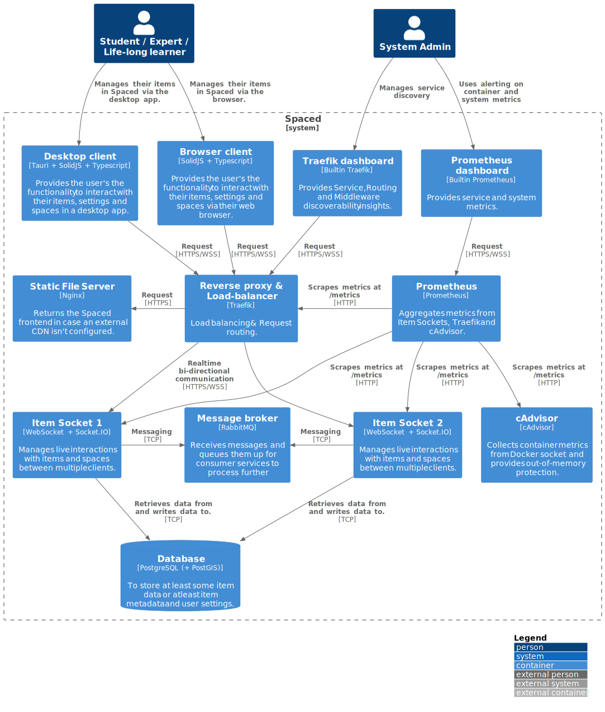
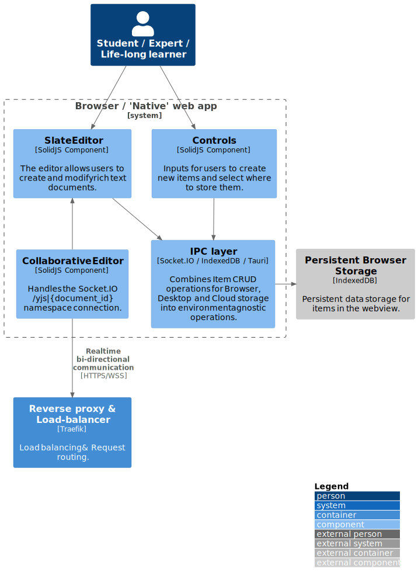
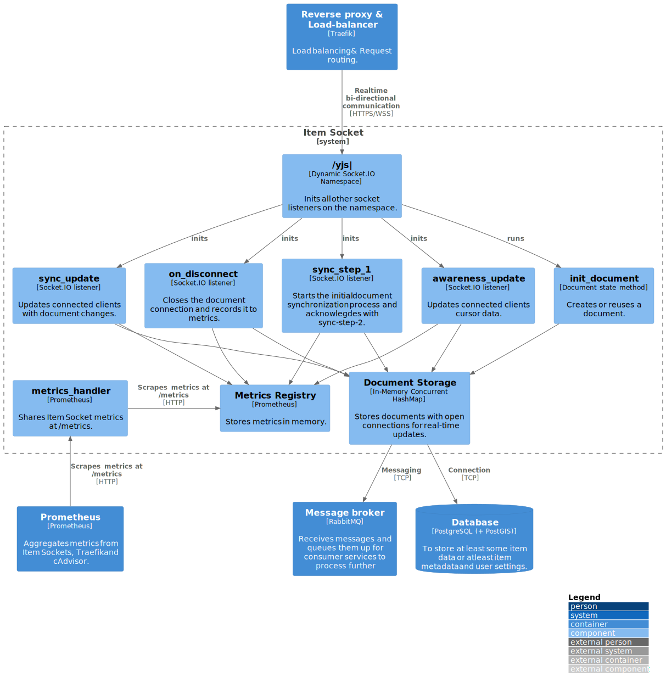
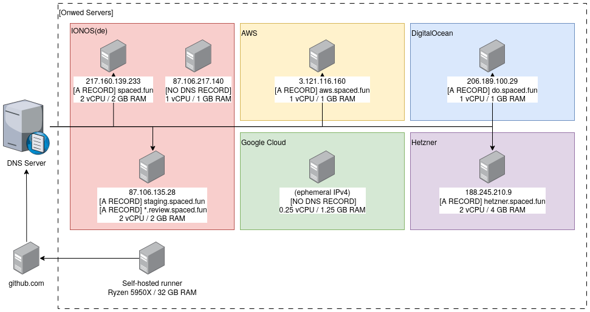
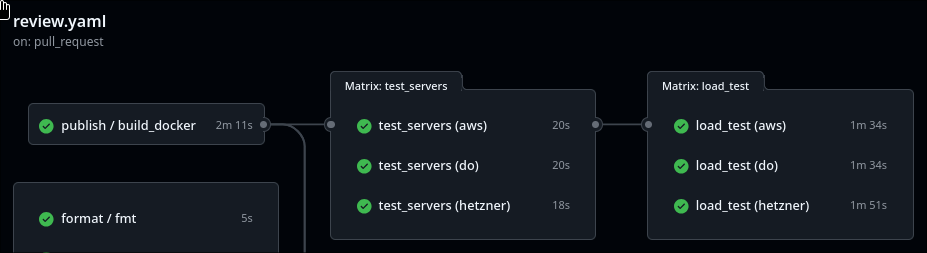

# Spaced - Architecture & (Infra)structure <!-- omit in toc -->

The guide describes the components, infrastructure and technologies used by Spaced. The guide also explains reasons for using certain technologies.

<div style="page-break-after: always;"></div>

## Contents <!-- omit in toc -->

<style>
  .toc > ul { padding-left: 1em; }
  .toc > * * ul { padding-left: 1em; }
  .toc > * > li { list-style-type: none; }
  .toc > * * > li { list-style-type: none; }
</style>

<div class="toc">

- [1. Architecture](#1-architecture)
  - [1.1. Services](#11-services)
  - [1.2. Components](#12-components)
    - [1.2.1. Frontend](#121-frontend)
    - [1.2.2. Backend: Item Socket](#122-backend-item-socket)
- [2. Infrastructure](#2-infrastructure)
  - [2.1. Production/Review/Staging Servers](#21-productionreviewstaging-servers)
  - [2.2. Test Servers](#22-test-servers)
  - [2.3. Self-hosted Runner](#23-self-hosted-runner)
- [3. Project structure](#3-project-structure)
  - [3.1. Languages](#31-languages)
  - [3.2. Tooling](#32-tooling)

</div>

<div style="page-break-after: always;"></div>

## 1. Architecture

### 1.1. Services

<!-- https://c4model.com/ -->

The following [container diagram](https://editor.plantuml.com/uml/lLTBR-Cs4BxdLqnzM3j8R6E3FVLGh1_gngqTUoMdQKu29T4E4KbKISgEKVI_TuQK7LbsYYoss1ivv72-UNqZVTQ6ALDcAOm-XLxACvuRVV6JoEEqJ3Wy6LFed_jznRQzjJ1FPLHghcAP6xpNYsNMBrAMatvNcoGLKN_qgRiWqVrisi-ODboXA1oX1XCvLxq2xrvC1u_p-sNuC5dUXbFlYtStxbnUBBZICk-GWMje1GRjvmRwuBqKND5YAbQycyfy3Ibd2Xzh7PHOaecSj7PeCOC1RV7KRSEXBFE4gLqdeeNQqSM2nJnfNVvz0T26qNJYtIq3N1-0TXAkduqimZWLY0DLnau0Jj12oPALIi0L138LoMy1hfQxWkjOYSAUBvJS27m7p1C7ygljbgioZusGEKk5sO6H832UYiK6jXXZkY8K24Ikhq5pOqI-ri3o13IXrdWT65JuW1L53rsjGu-KtAArL-X39wX1_z6GDu9LbxOyWWgWmzs6yI2u7Su7_lWu0qOnlXBFOSBqKoIPIYZaJWO76O4UbY95Yr0T7laHSBKHCRy6NvQ4oeAQYIH9-POf3edGiToWAv6mhebSY_MJqSsO5afc73qezH6UnK5y7jBh-H4gxL2v2BcQnMjAn7eV4z_xm_C33nR-_C_78oJOiKR4uKgaFAHtgdOX8VoAGkioDWTAxzOYVw65pqsfSfTAL_gmKhQB4wgcc6d20lm5auevXj7u3eJEsmQmrrTYNIgUD2EYE5hHFCJ8lEoi3Ri7kuSFC9KiwKOCoI1sQ6hfeJDmPvIJ3-3plqgk3IYNfQQjZ6lDrZp4mdcs_iwS09p0kiYYI9ZPL-TkpCK6urpfkL942wMhx0pA0bPIaNUwpB0pgeHeAcrq05SQQrxXNLKbvC4R1lFHxzuI0i-dt1m1fD8FjOoVkGa_8e89fJImU_X8a1vuL6slAdblCgU36SijmXG17xeAEqsxph8zLU-aY9ijvpba9HPOWUbsJNrIi7L4Dmr4DpyGKHjctjAVZ88tskceYLedky5whVYQ6PjCso5KkHdKtC4dzhH0gE91iX5QgcP0OkRa-EZ-Igkn7iaqvR7HL1TEwzZecEnXiRYmaR5Ytz5OjrsvwcOyasf7OiDjq5uvRZaO3WAl3caSTGgf3Jf8KHWpmo9iH1i39mw-Jg5p1RJxCWakRHD9q4OYSJ53On1RHcEuR5AGWGm3h6fct8ceU8NP0u9BZ7xWPuBspqKRxh6WuPV34FHv6ewhCNmoIVQrKIDy8f2AKogMh_Dx_RMJaVg-rngJhWs3yMnoXuZdGsh5mN0odImVwrF46Qq-2iwDaRtXFG_lfy3kWBXIVeFsxpLnIehV9KHVCgyLp2cbMymkkWZwcDYTiMPWJgdLiYFb_tQvN0JzXo0u86tcw9tAxJV3Xo3fO3Bozf4y4y9lWdW-YaSSy2RAetWHjCLWv8sR21jmcdJiSuRSX7qIYMuY5A--PJ1jMLRc8cQqFu_zFrucMgtkJPltpaxfffFEmNFgRmmyh3PB0gF5mMu3q7iL_UR8Uh_5UjwQPH34YXKrhaQMwk_ReFBwJ5MS9kp_UEVcEzwf3OjlUQBXHetTVTBWz4rYoTYE4wAAhH9cBpIoTnphSJExt_FWP_pOev-lVm40) is the latest version of the overall Spaced architecture.

> **Important**: The database and message broker services are not configured for deployments yet.
>
> - The actual working implementation is only able to use a single WebSocket server at the moment.
> - All data is either cached, stored in memory, or written to browser storage.
>
> **Note**: The following C4 Container diagram will likely be updated to reflect the following changes.
>
> - Scaling Item Socket servers will be possible in the near future whenever the message broker is either re-configured or replaced.
> - Reusing the old user service and fixing authentication to address missing cloud storage features includes reintroducing the database.
>
> 

<div style="page-break-after: always;"></div>

**The reason for using Traefik** as reverse-proxy over Nginx is the **out-of-the-box support** for Prometheus metrics, Free automatic TLS certificate renewal (using Let's Encrypt), the builtin dashboard and it's ability to deploy across Docker, Docker Swarm, and Kubernetes. **Why Nginx** is still used is solely because **Traefik cannot serve static files**. The frontend for the browser may be cached in a CDN like Cloudflare. **To be able to observe** both container metrics as well as system level metrics **cAdivsor with Prometheus allows** for observability features like **alerting when problems arise** and **to gain insights** on how the system and individual containers **perform**. See [the frontend](#121-frontend) and [the backend](#122-backend) for more.

<div style="page-break-after: always;"></div>

### 1.2. Components

#### 1.2.1. Frontend

The [frontend](https://editor.plantuml.com/uml/XPJ1Sjem48RlVeejXmHc0bnowga1F0aT6XZRDCt98wm5rCYIAya19isxToKJ0cGolMcbNV_V_bhvctNCkBgKCBpEOuabAcUZBq8LikO8Q-Sg-xNVDspJMmcthXUrHLDevIYlL-YoNqccV7tNEYx5eZ-yxixyrlp7f5yowz3GLZxKPQMLhwaeDvhSF4xdMVumpkxoINmRtu_QdMY6nchLzW9Nq4eTwIi7VOYt5Hg_c8WbTgLMAv38Z4BJwaJfZYJAVA1hnPdPjOMFh2wUqD571aPlw7DKUtdFd7Z6IzZW0bXLjJel4S01gsqbSvWZ5qu7TH_68MhvK4l1lwVl-NupMoCq1S2a927mw1QSXi8WrGDJ74hDnN87HXHhSBXrm7LH1vTxX7-CK6WfsUATOHXYRG8u_0VcZhGaaZX1fQ7ztdWA_Trl-_VbJJ4N_1KKAz5Mh42WMrHOEA7LHnBbZ9OsG3JBJuN7gggTXIMvSDw-mWtu-x3128kIr62pHeC-oL8xw7dBStbH5Rbakp06uzaGmhe1E3G6OyLnYtmqe7N6QYDQWRPS24KsZ4aMXiby19g6X_ac6yRzH5p12EsJqrL06qfTym34LWX24HsgPs6qyhO1MobjdIYElkMHNwDB62JJXpHE8CscoSrj71sQoECjDT8myWMX-UaMrZ-RDmP86y76nNqthTDKpXmxW7d-na-XmaNJB3yBt7YO16MU73jth4tdbv34F-CaZM6MJ7yzHlvU6LbbsWQVIG_pokZjZfAJ9eOGmmLCDEFT1QCtNJIta1c6I_7ab_uCcZD1p_824lnJetLWTErevuriT3xS7qMPTA94M8Wk5wOPIoPfHikoLg88heSvpx9Psdz8qtrFavjiFBrFzohDl-FiBRSQ1uupZWRyvFIqydWEJzBUopz9cP_tUuxKYRwXulvN-0y0) provides the user with controls to create and edit items which may represent anything you can think of that can be rendered using HTML.

> Note: Items are currently limited to just Rich text functionality.

> **Important**: The cloud option does not currently work as both the user login and crud operations on the backend have been disabled and will need to be re-implemented.
>
> 

<div style="page-break-after: always;"></div>

**How it works**

Items are rendered by their metadata and schema definition.

```ts
export type Item = {
  id?: number;
  x: number;
  y: number;
  w: number;
  h: number;
  editor: 'markdown' | 'rich';
  schema?: string;
  shared?: string;
};
```

Each item can configure an editor that allows read/write access to that item. Currently there is 1 main type of editor which is a rich text editor. This editor however can be wrapped into a collaborative editor so documents can also be shared with other users. Currently documents are created offline first and have the ability to be shared individually allowing for document edits with different groups of people at the same time. Whenever a document changes on the client the editor calls the IPC layer which handles updates to be persisted into the desired location. The locations available are by default the browser, when on desktop locally in a SQLite database and when logged-in, in the cloud.

**Technologies**

- [**CSS Transforms**](https://developer.mozilla.org/en-US/docs/Web/CSS/transform) The frontend leverages CSS transforms to utilize GPU-accelerated graphics when panning or zooming around in the application.
  > Note: In the future, some parts may be rendered using [HTML Canvas](https://developer.mozilla.org/en-US/docs/Web/API/HTMLCanvasElement) e.g. when making drawings. However, this will likely be implemented only when [WebGPU](https://developer.mozilla.org/en-US/docs/Web/API/WebGPU_API) has full browser support across all major vendors.
- [**SolidJS**](https://www.solidjs.com/) For its fine-grain reactivity and for its JSX templating.
- [**SlateJS**](https://www.slatejs.org) Used for editing rich-text items. Slate is not compatible with SolidJS so a custom implementation has been writen based on the ReactJS version.
- **[Yjs](https://docs.yjs.dev/), [y-socket.io](https://github.com/ivan-topp/y-socket.io), [and slate-yjs](https://github.com/BitPhinix/slate-yjs/)** Provide collaborative editing features using CRDTs (Conflict-Free Replicated Data Types) commonly found in collaborative text editing expriences.
- [**Tauri**](https://tauri.app/) Is used by Spaced as its desktop backend, which allows for creating desktop applications utilizing the system's built-in webview. Tauri is preferred over alternatives like Electron due to its reduced binary size and better performance.
  > Note: Other desktop backend options, like [Deno Desktop](https://github.com/denosaurs/deno_desktop), are unlikely to be adopted at this time.
- [**IndexedDB**](https://developer.mozilla.org/en-US/docs/Web/API/IndexedDB_API) Is used by Spaced to persistently store item data in the browser.

<div style="page-break-after: always;"></div>

#### 1.2.2. Backend: Item Socket

The [Item Socket](https://editor.plantuml.com/uml/dLPBa-8s4BxpApfpo32L09NKdd9Q5gWTgc26jPbizkGISWyeOqkE9C-49FlVjrl6OCmZgToiVglxwqz-xxomlimp6BrB9XdcgBthVAUqpCeKOUDzuNuP3Anuww-LtvIhqg6LHdkowqkJ3ufCQFRlEPzcQZKOlUijMFGqdmrouJnQ4YKZanT6iqz1jftPyClZqpBvF5tU9xF9nyd3k7lNkOLeykiaYYUmY1v_-z8PKHQXDDgknLUq3fF2cZ-tFy9DL9qXdE5xc1cHzbQ2qagqDsImj0AVrGj_iWugdT9hCexmZnAT1sjAJvB-pLqdtbATUVB1b3eLTjjLV796lg2d25CwGHnEDtT_Tm3sb-ccMvreLv3HOFkx-uVpZRTQv4hk7FhJHtWGERf2I6JrL2llG6GP6Bz12rKMo1HLG5TrO3IG0dJjnFKrKoeAaAH6bZmf2dXq3WNile4cwn5oz1kJic9aaGIKmO956YEL0RLZEulRQfcKHKeEvDauSQ33rUgoMVeKz0u871gbnnHafXXDy4R0sMS2kH5wZUviHefM93_L6QlJvOmnGzU5Td4NbCWEMJZ0nXgj_X9UKKy9AX8TNLcd8EIBDcyPhbFS5SVMFKxN-xbTbtWJbX8wTsX7M_H_UY9BwsWGf1RjZ4OdgN8x5mfoTBwSQvGPdYbtuz3hoeaRm1UtA8rD7IWFtZ0oh98dWwYTgVt6YZKs8HLNeWh8lJdcncx9LTDjBEllXTlCHL4DnrWgfuwsQxGfK3UgSl0Sq2YodbSvGjNFav9sbIOMrtHXonGmhqIqpPM8KowiORGJjXi5x7m98VJ9zLuAJh1CCxJasPAS2RqH7Bf13FiqmiEWqTYlWTLcm-NqyI7kH9WbupQR7JWaeZw4DgnKBrMsQX61ccWsBxMI0ScS_twvNCI3pt5C6QgO-o1jUh2bTgTMn-lDFfUCzXjvmUZCUbomRCEwDhk5yN0v_32C9mt69_9p1BHaPSrBcCcy4a0bu2P4OhLIVlufVAD4zHgc7SogFIUUBwkDo0bP0MgKtb5hY7VHlYh9MhFdXkVICYTJJVj2ngjkOPnVqxXv3sXRLy85_2ygSVnf1jqVW4yVf_5TU7mCyEeWOo53UWA9v6ce_AY4VMS25hxI127XHGG55ytlArNd-MqA4AhQs9hhcINTcnuDzryDwm5VCpmTyZNhrg2lcPxgBWoUcX5QErfSyMrCQhIdc8FRBSmdosWwYXiuA_PxVRBanwVXcYAl0vdNg_vC1aqEe12x_uumI3bCNnLnVF_yOCvmsld1N3Cy7SmrwzPWBfj6fwHunZYMLXIDVZIehoQfNRodepwV4kv_Y_GUTSe_Zzy0) service is the main service that handles item changes.

> 

<div style="page-break-after: always;"></div>

**How it works**

Items are the main way through which data is stored and rendered. They contain the following metadata:

```rs
pub struct Item {
  pub id: i64,
  pub x: i64,
  pub y: i64,
  pub w: i64,
  pub h: i64,
  pub editor: String,
  pub schema: Option<String>,
  pub shared: Option<String>,
}
```

This metadata can tell the frontend to pre-render the item structure and in future implementations may then allow for data like images and videos to be streamed directly after.

The Item Sockets in Spaced are the main service to handle item changes. They provide real-time updates
between clients. They use the [Yjs / Yrs protocol](https://crates.io/crates/y-sync) which use CRDT (Conflict-Free Replicated Data Types) for performant conflict free document editing. The Item Sockets collect metrics that Prometheus scrapes, so latency and the amount of open documents can be tracked.

**Technologies**

- **[Hyper](https://crates.io/crates/hyper), [Axum](https://crates.io/crates/axum), [and Tower](https://crates.io/crates/tower)** All services use similar backend libraries / frameworks like Hyper and Axum for HTTP servers and Tower as middleware.
- [**Clap**](https://crates.io/crates/clap) for CLI arguments like log level and server port.
- [**Tracing**](https://crates.io/crates/tracing) for logging.
- [**Socketioxide**](https://crates.io/crates/socketioxide) Is a Rust Socket.IO backend library for Real-Time messaging over different transports like WebSockets and HTTP long-polling, and provides reconnects and namespacing features. Likely, far in the future implementing a custom WebSocket and/or WebTransport protocol may be implemented for performance reasons.
- [**Distroless Docker image**](https://github.com/GoogleContainerTools/distroless) used for its low CVE count and small image size.

<div style="page-break-after: always;"></div>

## 2. Infrastructure

The infrastructure that allows Spaced to be maintained as shown below consist of a multitude of servers and also a self-hosted GitHub Actions runner. The servers are hand picked to be cheap, but also be somewhat diverse so different specs and providers can be tested.

> **Note**: Not all servers are in use and therefore some connections are missing.
>
> 

### 2.1. Production/Review/Staging Servers

The servers are marked by the provider they are from via their subdomain. All servers are interacted with through GitHub Actions

| Provider                                 | IP              | DNS                                                                | Config | Status   |
| ---------------------------------------- | --------------- | ------------------------------------------------------------------ | ------ | -------- |
| [IONOS(de)](https://cloudpanel.ionos.de) | 217.160.139.233 | [A RECORD] spaced.fun                                              | Manual |          |
| [IONOS(de)](https://cloudpanel.ionos.de) | 87.106.135.26   | [A RECORD] staging.spaced.fun <br> [A RECORD] \*.review.spaced.fun | Nix    | Deployed |

<div style="page-break-after: always;"></div>

### 2.2. Test Servers

All test servers are marked by the provider they are from via their subdomain. All servers are interacted with through GitHub Actions. The reason for these servers is to be able to run load tests in a reproducible manner which impart is made possible by GitHub actions.

| Provider                                                                                             | IP                         | DNS                           | Config | Status   |
| ---------------------------------------------------------------------------------------------------- | -------------------------- | ----------------------------- | ------ | -------- |
| [IONOS(de)](https://cloudpanel.ionos.de)                                                             | 87.106.217.140             |                               | Manual |          |
| [AWS](https://eu-central-1.console.aws.amazon.com/ec2/home)                                          | 3.121.116.160              | [A RECORD] aws.spaced.fun     | Nix    | Deployed |
| [GC](https://console.cloud.google.com/compute/instancesDetail/zones/europe-west4-b/instances/spaced) | 34.141.195.208 (ephemeral) | [A RECORD]                    | Nix    | Deployed |
| [Hetzner](https://console.hetzner.cloud)                                                             | 188.245.210.9              | [A RECORD] hetzner.spaced.fun | Nix    | Deployed |
| [DigitalOcean](https://cloud.digitalocean.com/droplets)                                              | 206.189.100.29             | [A RECORD] do.spaced.fun      | Nix    | Deployed |



### 2.3. Self-hosted Runner

The self-hosted runner is used to run load tests on more capable hardware so higher loads can be generated. The runner may be used for other jobs in the future.

| GitHub runner | Specs                   | Status      |
| ------------- | ----------------------- | ----------- |
| Spaced        | Ryzen 5950X / 32 GB RAM | (add badge) |

<div style="page-break-after: always;"></div>

## 3. Project structure

### 3.1. Languages

- [Rust](https://www.rust-lang.org/)
  > For perf, and safety. the fact the language might be slower to develop cause of compile times, and certain complexities are somethin I choose to deal with as it's a long term project
- [Type-/JavaScript](https://www.typescriptlang.org/)
  > No other alternatives for web frontends besides [WASM](https://webassembly.org/), which may be tried instead. A branch already exists on which [leptos](https://www.leptos.dev/) would swap out the TypeScript on the frontend. It's been discontinued for now as it required unstable Rust features at the time. See [branch](https://github.com/Ekhorn/spaced/tree/leptos).
- SQL
  > Used for database migrations.
- [Nix](https://nixos.org/)
  > Used for VPS cofigurations.

<details>
<summary>Overview</summary>

```sh
$ cloc --vcs=git

224 text files.
210 unique files.
 15 files ignored.

github.com/AlDanial/cloc v 2.02  T=0.20 s (1076.9 files/s, 140186.9 lines/s)
-------------------------------------------------------------------------------
Language                     files          blank        comment           code
-------------------------------------------------------------------------------
JSON                            31              0              0           9254
TypeScript                      76           1492           1320           8700
Rust                            19            290            135           2029
Markdown                        21            549             40           1141
YAML                            24             52            145           1013
Nix                              4             20             12            187
TOML                             7             17              2            182
CSS                              1             26              1            133
JavaScript                       4              6              9            121
Bourne Shell                     5             22              5             96
SQL                              6              4              0             58
PlantUML                         2             24             36             56
Dockerfile                       5             13             12             45
SVG                              1              2              1             26
Protocol Buffers                 2              5              0             25
HTML                             1              0              0             18
INI                              1              2              0             11
-------------------------------------------------------------------------------
SUM:                           210           2524           1718          23095
-------------------------------------------------------------------------------
```

</details>

### 3.2. Tooling

- [Docker](https://www.docker.com/) can be used in development altough [Podman](https://podman.io/) may also be used. Docker is primarly used in Production with [Docker Swarm](https://docs.docker.com/engine/swarm/) enabled (see [why docker swarm](./deployments/swarm.md#1-why-docker-swarm)). Docker is used as method for containerization for shareble and somewhat reproducible services. In the future docker images may build with [nixos-generators](https://github.com/nix-community/nixos-generators) to make containers truly reproducible. Another technology to consider is [WASI](https://wasi.dev/) which provides a way to have sandboxed services without containerization or virtualization for less overhead.
- Altough not currently in use [Kubernetes](https://kubernetes.io/) it has been used before to deploy older versions of Spaced.
- [Nix](https://nixos.org/) and [NixOS Anywhere](https://github.com/nix-community/nixos-anywhere) are used for reproducible VPS configurations see [why nix](./deployments/vps/nix.md#1-why-nix-and-why-not).
