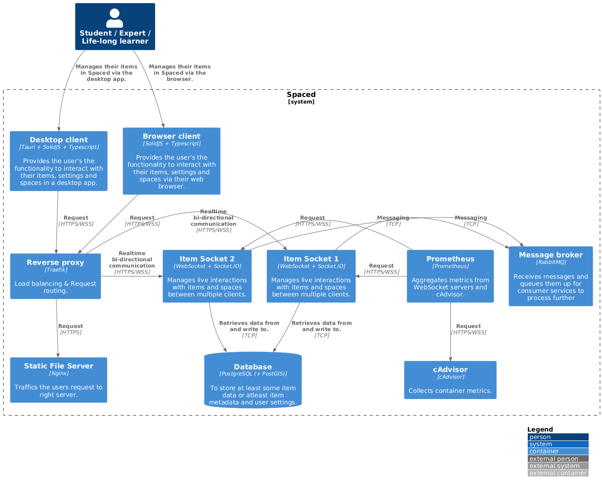

# Architecture <!-- omit in toc -->

The guide describes the components that make Spaced including current infrastructure.

## Contents <!-- omit in toc -->

- [1. Backend](#1-backend)
- [2. Frontend](#2-frontend)
- [3. Infrastructure](#3-infrastructure)
- 

## 1. Backend

> Note:

**Overview**

- Language: Rust
  > The backend is written in Rust for it's performance and safety. Spaced is meant to be a long term project that should mature overtime, however adding new features should continue to be performant, therefore the choice of a lower level language offering more control.
- Desktop Framework: Tauri
- HTTP Server Framework: Hyper + Axum
- WebSocket Framework: Socketioxide (Socket.IO)

**Reasoning**

It works well with the Tauri backend framework for desktop applications using the builtin system webview. Tauri is used over e.g. Electron for the reduced binary size and better performance. Any other Desktop backend options like [Deno Desktop](https://github.com/denosaurs/deno_desktop) are unlikely to be changed at the time of writing.

The services currently present can been seen below in the container diagram. All services use similar backend library/frameworks like Hyper, and Axum.

The **item_socket** is the main component communicating changes to items. It uses the socketioxide Rust Socket.IO backend library for Real-Time messaging over different transports, and provides reconnects and namespacing features. Likely, far in the future rolling a WebSocket and/or WebTransport protocol may be implemented for performance reasons. The service also makes use of y-rs to which implements the YATA CRDT spec for performant conflict free document editing. (Rootless/distroless)

- Traefik: Reverse-proxy and load-balancer, handling requests in either Docker / Docker Swarm / Kubernetes
- Nginx: Server for Web frontend, if CloudFlare isn't used for
- Prometheus: Metrics gathering
- cAdvisor: System and Docker Metrics gathering

## 2. Frontend

Frontend

- HTML Transform vs Canvas

y-js CRDTS
TypeScript
SolidJS

## 3. Infrastructure

Docker

- https://docs.docker.com/subscription/change/

Docker Swarm

- https://docs.docker.com/engine/swarm/swarm-mode/
- Docker stack
- Secrets https://docs.docker.com/reference/compose-file/secrets/
- Configs https://docs.docker.com/engine/swarm/configs/

Kubernetes

NixOS Anywhere

GitHub Actions

- Personal Runner
- Lighthouse
  https://googlechrome.github.io/lighthouse-ci/ https://github.com/GoogleChrome/lighthouse-ci/blob/main/docs/configuration.md
- Build job
- GitHub registry

Topology

| Provider                                 | IP                         | DNS                                                                            |
| ---------------------------------------- | -------------------------- | ------------------------------------------------------------------------------ |
| [IONOS(de)](https://cloudpanel.ionos.de) | 217.160.139.233            | [A RECORD] spaced.fun                                                          |
| [IONOS(de)]()                            | 87.106.217.140             |                                                                                |
| [IONOS(de)]()                            | 87.106.135.26              | [A RECORD] ionos.spaced.fun                                                    |
| [AWS]()                                  | 3.121.116.160              | [A RECORD] aws.spaced.fun / ec2-3-78-229-88.eu-central-1.compute.amazonaws.com |
| [GC]()                                   | 34.141.195.208 (ephemeral) | [A RECORD]                                                                     |
| [Hetzner](https://console.hetzner.cloud) | 188.245.210.9              | [A RECORD] hetzner.spaced.fun                                                  |
| [DigitalOcean]()                         | 206.189.100.29             | [A RECORD] do.spaced.fun                                                       |

## 

The [Architecture design](https://www.plantuml.com/plantuml/uml/lPJ1Rjiu48RlVefPN-mWZOqQFUsXg6CBhNVjn9MKpVOaKDBO8IAHMfAoOopstNSeAgh2e4YGGsxaa3FppN3uVz66ALEN1Im-9K619GgZ1xznaHLrZd1dJAL_dquLEqxstDpLQQrHPL8OkZV9P3cj2YQi_uKsUS7JwUBJnTQQRZRhQScqGKMcP44UZ0jKauhk3jRp7zStSNAxYhybw-1hSBKSdmssgBGKOvlW0mmZG_c5WIa43nKgkrZp7LuKKkoXGAOesF1i49qeHPbSobhaJ9t6gLseamrGiGppuTc_0u0HBDQhu2gEQDsXZ7FKzqPMILPmoaGkIsS0PnYI9MQrud0EaInu_aT4g_XKeSuKhvhphP87Jd70t25Oyf5RxcgH6Iu5AxWvWP70XK75CWD7wgAzmXLm8jSVGACnNEmrC963jjIQhWE3bWzOLKser3vwgkIHilr4ltI67lfx8nyuQoyTCOKMq76F80p-2i8eW6ru_VUF9vKeFA3Ic5HAFjXd2zqUchtblTfpyM0NiMAx7Sz-WcjG-4-DsbXQnVTt1iXAxdwtIjIQxJ4XgFjck3RE0CvWWuSiJRdPV6_Mc24_e8RMpvL9cMhNjHBg2dPIGIQ5hajKJLgUsLDfmMcbgP-Axggs0RV1PNIz-3E88Gf2suidWBQjYPRPFPha8n6iQ0zHiuUF5kaMqtPxtjedgsjxi66Y8Im8k7inJbpkrMpW9w-KeZaY2YZhml2gm7PWTBzbFj7C8vgz8z48Da4ShXPF-qKzBf6wMsixqDrc-6mtt-yLxfbf7jCeEpqxkW0TVJinZYYRvmUkvRFvoPYpKy37AqDllP15WPdHa3rwjGcxEfRpU7uvZu9-v6KwhgGsnAYj_333KgQnASEPe-zh69-3tNrTHMVs99QWZLG8p5WTr0OqLTpq5NAA05BHaJknHil1x84jiVattVUrQFyDHd13CmcVEuqCiKYMhGvxGjCzRryFh5evjNqKWVxtxqVp5VULqJmXV5Hp-EpfYalb9tccC4uqR2-_nV4scjv6KSVfr_jAPq_XYApxyAwVeIzq_fSFaHM6bmWflyYvmbQB8PDbMGkUCRltqxuOUVRMo2EmiTT-x5yeAGrJCvgBRGVbrVSsnzdh7TTzKV2x-ujdUy5nzjAmz1qxZNZ1noFhVV_GwWMrMpVVsEcK_R97HJvWvAHVi1zgzjPGNr3aTLdy3m00) design is the latest version of the Spaced architecture. The actual working implementation
is only able to use a single WebSocket server at the moment, but scaling these will be possible in the near future.
Socket.IO is used for the WebSocket servers (called item_sockets) to support transport types i.e. Long-polling &
WebSocket, and to introduce name spacing. The item sockets are the main services that send real-time updates
between the clients. They implement the Yjs / Yrs protocols to sync CRDT (Conflict-Free Replicated Data Types),
which ensure no conflicts occur in user documents in an intuitive manner.
The Item Sockets collect metrics that Prometheus scrapes, so latency, and the amount of open connection /
documents can be tracked. Prometheus also scrapes the metrics cAdvisor collects about the running containers
for a general overview or resources used. The cAdvisor metrics can be used to alert when resources are reaching
limits, and ideally in Kubernetes help inform when to auto-scale pods.
In the near future additional services for may be introduced for scalability reasons and/or separation of concerns,
e.g. for authentication.

The current architecture of Spaced defined does not actually implement RabbitMQ yet. It used to, but now that the websocket servers have changed a solution for clients connected to different websocket server must again be implemented. The cs C4 Container diagram.

> Note: the following C4 Container diagram will likely changed in the near future.
> 
